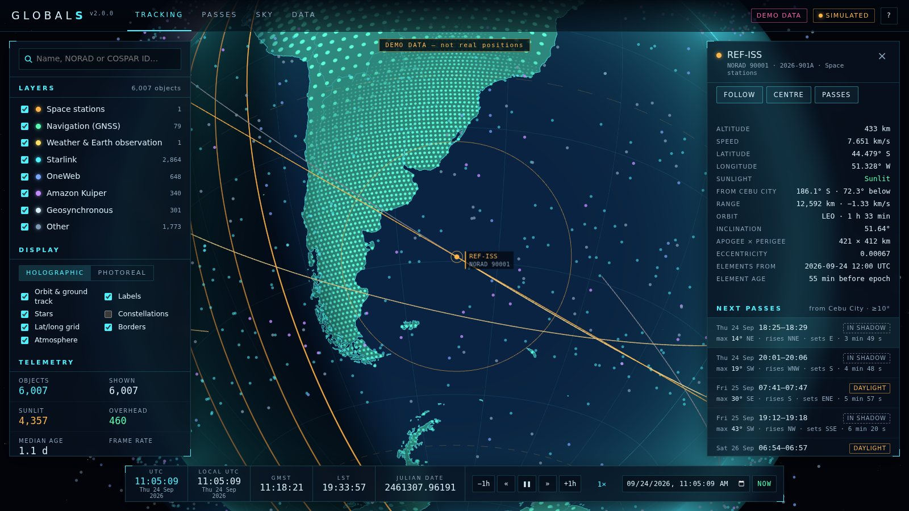
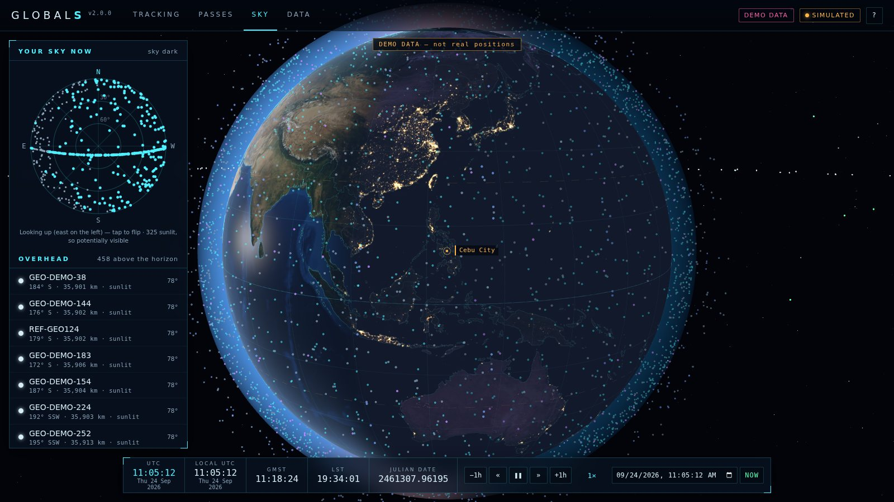

# GlobalS — Global Satellite Tracker

Every active satellite in real time on a 3D globe: about 16,800 objects, positioned with SGP4 from
public orbital data. It predicts passes over your location (Cebu City by default) and shows a
radar of your sky.

## Download for Windows

**[Download GlobalS.html](https://github.com/GrantWally120/GlobalS/releases/latest/download/GlobalS.html)**:
one file (about 8 MB), with nothing to install.

1. Download it. If your browser asks whether to keep it, choose **Keep**; it's a web page, not a
   program.
2. Double-click `GlobalS.html`. It opens in Microsoft Edge (or Chrome).
3. The first start needs internet, for the satellite data. After that it also starts offline, using
   the last data it downloaded.

The satellite data is refreshed on GitHub every 6 hours, and an open GlobalS picks it up by itself.
You only need a new copy of the file when there's a new version of GlobalS.





<sub>Screenshots use the built-in demo data (reference orbits plus synthetic constellations), which
the app labels as such. The app itself shows real satellites.</sub>

## What it does

- **Live positions.** Every active satellite from [CelesTrak](https://celestrak.org), refreshed on
  the site every 6 hours and computed in your browser. The Starlink, OneWeb, Kuiper and Qianfan
  constellations are all there.
- **Two globes.** The holographic HUD is the default. The photoreal globe uses NASA's Blue Marble
  and Black Marble imagery. Both show the real day/night line and twilight bands. Press **V** to
  switch.
- **Find anything.** Search by name, NORAD number or international designator. Show or hide
  categories: space stations, navigation, weather & Earth observation, science, amateur radio,
  Starlink, OneWeb, Kuiper, other constellations, geosynchronous.
- **Satellite details.** For the selected satellite:
  - orbit, ground track and coverage circle;
  - altitude, speed and period;
  - apogee, perigee and inclination;
  - sunlit or in Earth's shadow;
  - how old its orbital data is;
  - where it is in your sky right now.

  Press **F** to fly alongside it.
- **Passes over you.**
  - The next 7 days for any satellite, each with a sky chart.
  - *Tonight's visible passes*: when your sky is dark but the satellite is still in sunlight, so you
    can actually see it.
- **Your sky now.** A radar of everything above your horizon. The geostationary belt shows as an
  arc.
- **Real star sky.** 5,044 naked-eye stars and the constellation lines, precessed to today.
- **Time travel.** Pause, or run up to 3,600× forwards or backwards, and jump to any date. The
  badge always says whether you're seeing **LIVE** or **SIMULATED** time.
- **Your own data.** Drag in a TLE or OMM JSON file, or right-click one in Explorer and choose
  **Open with GlobalS**.

## The web version (optional)

GlobalS can also run as a website that installs as a Windows app, with Start-menu shortcuts and
"Open with GlobalS" for TLE files. That needs GitHub Pages switched on (see *How it's published*).

1. Open <https://grantwally120.github.io/GlobalS/> in Microsoft Edge (Chrome works too).
2. Click **Install** in GlobalS's top bar. In Edge you can also use **⋯ → Apps → Install GlobalS**.
3. GlobalS opens in its own window and appears in the Start menu. Right-click it on the taskbar to
   **Pin**. The pinned icon's right-click menu has shortcuts to *Visible passes tonight* and
   *What's overhead now*.

After the first start it works offline, using the last orbital data it downloaded. New versions
install themselves: when one is ready, a **Reload** button appears. To uninstall, go to
**Start → right-click GlobalS → Uninstall**, or open `edge://apps`.

## How accurate is it?

The maths is checked against independent references by the test suite, which runs on every push:

| What | Reference | Largest difference |
| --- | --- | --- |
| SGP4 positions and velocities | Vallado's official verification cases (500+ states) | under 0.2 mm |
| Pass rise / set times (95 passes of 7 reference satellites over Cebu) | Skyfield 1.55 | 0.04 s / 0.23 s |
| Pass peak elevation | Skyfield 1.55 | 0.005° |
| Sun position (1990–2045) | Skyfield + JPL DE421 | 0.009° |
| Dusk and dawn times in Cebu | Skyfield + JPL DE421 | 10 s |
| Star positions (precession) | Skyfield | 1″ |

The limit in practice is the orbital data itself. Public element sets are good to about a kilometre
near their epoch and drift by a few kilometres per day, so GlobalS shows how old each element set is.

Some other limits:

- Pass times are for the geometric horizon, ignoring refraction. Near the horizon, satellites
  appear a few seconds earlier than predicted.
- Brightness (magnitude) is not predicted, because the public data has nothing to base it on.
- Travelling far back or forward in time still uses today's catalogue.

Compared with Heavens-Above or N2YO, pass times should agree to within about a minute. They use the
same kind of data, so differences come down to data age and the minimum elevation you choose.

## How it's published

The **Publish GlobalS** workflow runs on every push to `main`, every 6 hours, and on demand
(**Actions → Publish GlobalS → Run workflow**). It does three things:

1. **Data.** It downloads the orbital data from CelesTrak into the `data` branch. The app reads it
   from there through raw.githubusercontent.com, or jsDelivr as a fallback.
   - Each CelesTrak group is downloaded at most once per 2-hour update cycle, as CelesTrak asks.
   - If CelesTrak is unreachable, the previous data stays.
   - A catalogue with fewer than 1,000 objects is never published.
2. **Download.** It builds `GlobalS.html` and attaches it to the latest release. This happens on
   pushes and manual runs.
3. **Website (only if switched on).** With **Settings → Pages → Build and deployment → Source:
   GitHub Actions**, it also publishes the web version. With Pages off, this step is simply
   skipped.

GitHub pauses scheduled workflows after 60 days without repository activity. If the data badge in
the app turns red (data more than two days old), open the **Actions** tab and re-enable
**Publish GlobalS**.

## Running it locally

You need [Node.js](https://nodejs.org) 22 or newer; there are no npm packages to install.

```sh
node tools/serve.mjs                 # then open http://localhost:8080/
node --test "tests/**/*.test.mjs"    # the test suite
node tools/check-imports.mjs         # checks every import, worker and asset path
node tools/build-single.mjs          # builds the download, dist/GlobalS.html
```

Run locally, the app reads the GlobalS data feed. If it can't reach the feed, it uses the demo data.

To try the installed, offline version locally:

```sh
node tools/stage-site.mjs _site && node tools/stamp-sw.mjs _site
node tools/serve.mjs --root _site    # then open http://localhost:8080/?sw=1
```

Useful URL options:

| Option | Effect |
| --- | --- |
| `#sat=25544` | Select a satellite by NORAD number (the address bar updates as you select). |
| `?t=2026-09-24T19:30` | Start at a time (read in your computer's time zone; add `Z` for UTC). |
| `?rate=0` | Start paused (or any speed, e.g. `60`). |
| `?style=photo` | Start with the photoreal globe. |
| `?tab=passes` | Open a tab: `tracking`, `passes`, `sky` or `data`. |
| `?data=fixtures` | Use the demo data. |

## Keyboard

| Key | Action |
| --- | --- |
| `/` | Search |
| `Space` | Pause / play |
| `[` `]` | Slower / faster (below zero runs backwards) |
| `Shift` + `←` `→` | Step one hour |
| `N` | Back to now |
| `F` | Follow the selected satellite |
| `O` | Orbit and ground track on/off |
| `V` | Holographic / photoreal globe |
| `C` / `G` | Constellation lines / latitude–longitude grid |
| `R` | Reset the view |
| `Esc` | Deselect |
| `?` | Help |

## How it works

- **Plain files.** HTML, CSS and JavaScript modules, with no framework and no build step.
  - Third-party libraries (three.js, satellite.js) are copied verbatim from npm by
    `tools/vendor.mjs`, which checks their published checksums.
  - `node tools/vendor.mjs --check` proves they're unchanged.
- **Workers.** A Web Worker runs SGP4 for the whole catalogue.
  - It computes a snapshot every 60 seconds of simulated time (every 180 s or 900 s at high speed).
  - Each frame blends between snapshots with cubic Hermite interpolation, which is accurate to
    under a metre.
  - The selected satellite is computed exactly on every frame.
  - A second worker predicts passes: it scans for peaks, then refines rise, peak and set, as
    Skyfield does.
- **Where the code lives.**
  - `js/core/` holds all the astronomy. It is pure JavaScript, so the tests run it in Node.
  - Rendering lives in `js/render/` and the interface in `js/ui/`.
- **Data relay.** CelesTrak doesn't allow browsers to fetch its data directly. The publish workflow
  therefore downloads it (`tools/fetch-celestrak.mjs`) into the `data` branch.
- **One file.** `tools/build-single.mjs` embeds every module, the map, the stars and the NASA
  imagery in one HTML page.
  - It rewrites only import paths. A small loader turns each module into a `blob:` URL at start-up.
  - Each worker builds its own modules the same way, because a double-clicked `file://` page may
    not start module workers from `blob:` URLs.
  - The last data is kept in IndexedDB for offline starts.
- **Offline (web version).** A service worker (`sw.js`) caches the app per build. It keeps the
  last good orbital data for offline starts.

## Credits

Orbital data from [CelesTrak](https://celestrak.org). Earth imagery from NASA Earth Observatory.
3D graphics by [three.js](https://threejs.org), SGP4 by [satellite.js](https://github.com/shashwatak/satellite-js),
maps from [Natural Earth](https://www.naturalearthdata.com), stars from [d3-celestial](https://github.com/ofrohn/d3-celestial).
The details and licences are in [ATTRIBUTION.md](ATTRIBUTION.md).
